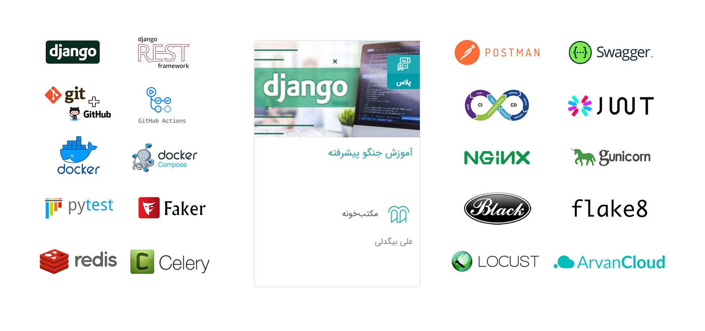

### Home school training course taught by Professor Ali Bigdeli

### 📘 Course Topics

**Introduction of the Course**

**Setting up Project with Docker (Dockerfile, docker-compose)**

**Setup Django Model for a Blog and AbstractBaseUser**

**Implement Class Based Views**

**Django Rest Framework and Serializers (FBV)**

**Class Based Views in Rest Framework (views, generic, viewset)**

**API Documentation with Swagger and Redoc**

**Authentication API (Token / JWT)**

**Reformat and Lint (flake8, black)**

**Django TestCase and PyTest**

**Django CI with GitHub Actions**

**Populate Database with Faker and Django Commands**

**CORS Headers**

**Load Testing with Locust**

**Background Process with Celery and Redis**

**Caching with Redis**

**Get Ready for Deploy (Gunicorn, Nginx)**

**Buy and Setup VPS (IaaS)**

**Django CD with GitHub Actions**

<h3>👨‍🏫 Instructor</h3>

  <strong>Ali Bigdeli</strong> — a highly experienced software engineer and educator, renowned for his contributions to professional software architecture, backend development, and technical training.  
  🔗 <a href="https://github.com/AliBigdeli" target="_blank">GitHub Profile</a> 
  📚 <em>Expertise:</em> Software Engineering · System Design · Technical Mentorship · Advanced Backend Development

